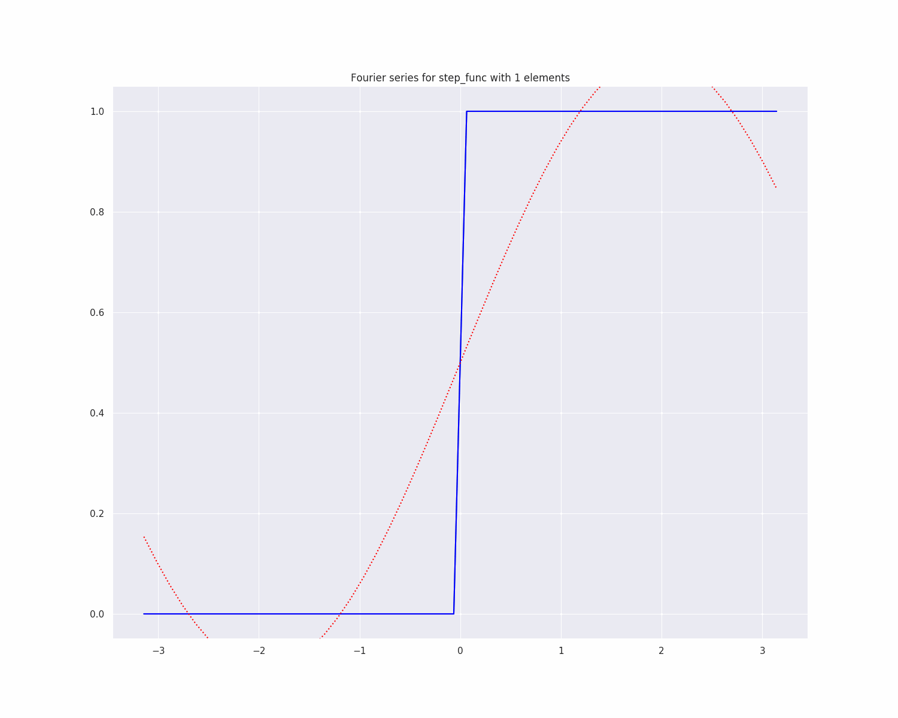

****Interactive Fourier Series****

Fourier series - https://en.wikipedia.org/wiki/Fourier_series.

The following implementation is based on <a href='https://pypi.org/project/symfit/'>symfit</a> library and was made only
for interactive purposes.

To use a program, please install the requirements listed in [requirements.txt](requirements.txt).
There is only one command that can be run the following way :

`python run.py`

You have a possibility to specify which function to approximate among the defined at [functions.py](functions.py), by using
`--func` parameter why starting the programm.

`python run.py --func="power_func"`

For now this list of functions could be used:

``sigmoid, relu, step function, power function, exp function,
log2 function, ln and log10 function.``

You can also save the output as animated gifs by passing `--s=True` to the command.
To got to know about more parameters that you can pass to program, please use the following command:

`python run.py --h`

Note, that implementation is greedy with respect to computations, thus specifying big number of Fourier series' members is computationally heavy.

Example of usage:

For more examples, please head on to the next [folder](generated_gifs).